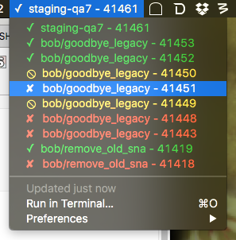

## About

This is a plugin I wrote to monitor my Circle builds from my menu bar like a lazy person. It used to be better written, but it didn’t really work well with the number of builds that are run here, so I hacked together an update quickly. Hope you find it helpful.

NOTE: This used to use the `recent-builds` Circle API endpoint, but that only queries the 30 most recent builds. Given the number of builds run at UT daily, this would pretty much ensure no one ever saw their builds in Bitbar. I rewrote the script to use the `projects` endpoint instead. This has the side effect that every time a build of master is being run, it'll show up for everyone who has contributed to that project. Not necessarily a bad thing, we can all keep an eye on master.

Master builds will show up as `master (reponame)`

## Preview



## Installation

1. Download and install Bitbar: https://github.com/matryer/bitbar (you’ll be asked to create a folder for your bitbar plugins during install)

2. Move the `circle.5s.py` file to the plugin folder (DON’T MOVE THIS README THERE)

3. Create a file called `.circle` in your home directory and paste your CircleCI token in there

4. Add your GitHub username (the one you use to login) to your gitconfig under [user], e.g.
    ```
      [user]
        username = nifengle
    ```

5. `chmod +x circle.5s.py`

6. Click on Bitbar in the menu bar, then Preferences > Refresh all. Watch your build statuses from your menu bar. Click the latest build name on the menu bar to see a dropdown of your 10 most recent builds (across all projects you’re subscribed to in Circle). Clicking on a build will open your browser to that build’s url.
